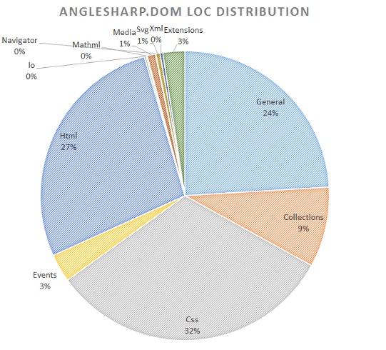

Yesterday the latest version of Anglesharp has been released. This release marks the v0.9 milestone. Besides providing skeleton implementations for, e.g., the recent shadow DOM API draft, the `picture` element, etc., this version fixes some bugs that may appear in conjunction with using scripts.

Scripts are one of the success stories for AngleSharp. They make this library so useful. Therefore the AngleSharp.Scripting project is moving forward as well. The *AngleSharp.Scripting.JavaScript* library was yesterday released in with version 0.3. Here we will now try to align with the versioning of AngleSharp.Core.

AngleSharp.Core will definitely be split up. The library is already too huge and contains too many features to be considered lightweight. Let's have a look at the SLOC (taken two months ago) of the DOM part alone:

From this picture alone we can already estimate that splitting the library could be benificial. We have roughly 1/3 SLOC spent on general, HTML and CSS functionality. The splitting could therefore result in three or four parts:

* *AngleSharp.Core.Common*, containing the basic infrastructure and definitions [no dependency]
* *AngleSharp.Core.Html*, containing the HTML parser and DOM implementation [depending on Common]
* *AngleSharp.Core.Css*, containing the CSS parser and CSSOM implementation [depending on Common]
* *AngleSharp.Core.Complete*, aggregating the Core and providing further helpers [depending on the former three]

Experiments with a proper dissection will begin soon. Also the renderer part will then be discussed. Plans have already been made and it seems likely that a renderer will be published within this year (experimental stage). Here a new project, AngleSharp.Renderer will be opened. The renderer itself will contain many libraries, specifically to make the renderer common infrastructure a PCL again with specific platform libraries that contain the actual drawing code.