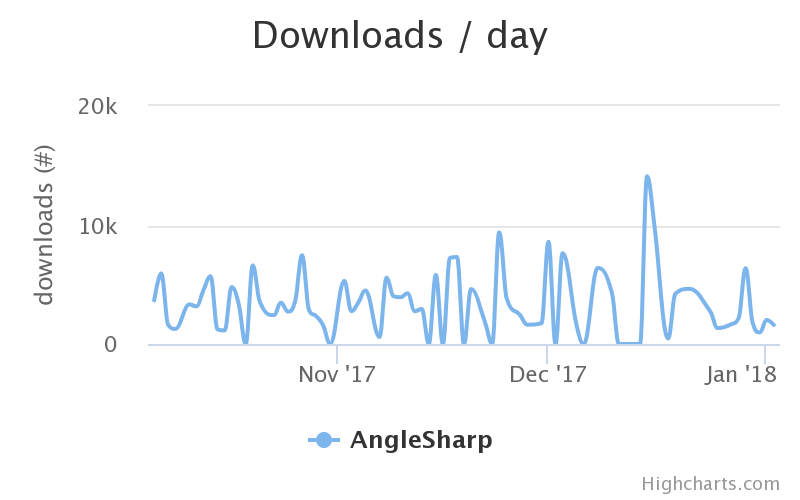
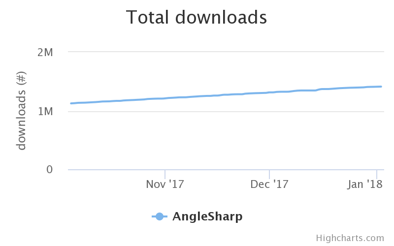

For over a year the development of AngleSharp was stale. But the project is not dead! Today I am proud to release a hotfix to the very successful version v0.9.9, called v0.9.9.1. This hotfix contains some critical fixes and improvements. It also paves the way for the v0.10 release, which is stuck with an observer problem (namely how to attach dynamic listeners to attribute changes for - from the perspective of AngleSharp.Core - unknown attributes), which is solved in this hotfix. In the long term this also enables users to disable the dynamic DOM, resulting in even better performance for static analysis when a fully dynamic DOM is not needed.

One of the things that kept AngleSharp stale was the issue of the broken tool chain. Essentially, .NET Core broke earlier behavior and as there was no global.json available the latest SDK was used by AppVeyor. Thus our build was not working (on AppVeyor, or many newer platforms that missed the required SDK) anymore. Now we specify the right SDK and also fully support Linux builds (at least WSL compatible), which had some minor issues previously.

AngleSharp is already quite in use and popular these days. The NuGet statistic of downloads per day also confirms this.

More importantly, the overall number of downloads is pretty much constantly increasing. Thus we do not see any decline in AngleSharp's usage. However, increasing the number of downloads per day (i.e., stepping back in the arena with HtmlAgilityPack) will be an important goal for 2018.

To achieve this goal we will try to finally publish v0.10. If this can be done in the first half of 2018 then the way for v1 is definitely free. For v1 we will try to improve / realize

- a better JS engine integration (e.g., capable of Angular, React, ...),
- finished AngleSharp.Css (at least API-wise),
- more complete AngleSharp.Io package (including file and directory upload options etc.),
- a very simple renderer, and
- a very complete NuGet package that hosts everything combined (AngleSharp.Browser).

Let's see what can be done! Happy new year everyone and thanks for using AngleSharp.