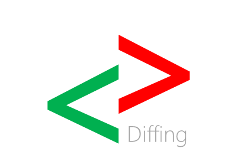
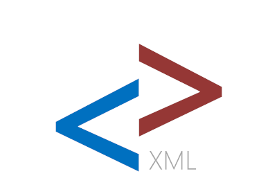
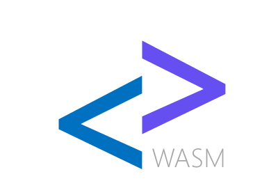

::: feature
 {.feature-image .img-responsive .pull-right}
<h2 class="feature-heading" id="anglesharp-core">AngleSharp.Core</h2>

HTML parser, DOM provider, CSS tokenizer, and core utilities. Helpers and parsing for mime types, URLs, source sets, and many more. Provides extension points, which are then used by the other projects.

Currently in beta. Considered stable. <a href="https://github.com/AngleSharp/AngleSharp">AngleSharp/AngleSharp</a>

:::

::: feature
 {.feature-image .img-responsive .pull-left}
<h2 class="feature-heading" id="anglesharp-css">AngleSharp.Css</h2>

A full CSS parser and CSSOM provider to include support for stylesheets, inline styles, and style computations within AngleSharp.

Currently in beta. Considered stable. <a href="https://github.com/AngleSharp/AngleSharp.Css">AngleSharp/AngleSharp.Css</a>

:::

::: feature
 {.feature-image .img-responsive .pull-right}
<h2 class="feature-heading" id="anglesharp-diffing">AngleSharp.Diffing</h2>

Makes it possible to compare two AngleSharp node lists and get a list of differences between them. Used in bUnit.

Stable and production ready. <a href="https://github.com/AngleSharp/AngleSharp.Diffing">AngleSharp/AngleSharp.Diffing</a>

:::

::: feature
 {.feature-image .img-responsive .pull-left}
<h2 class="feature-heading" id="anglesharp-io">AngleSharp.Io</h2>

IO modules and helpers, including - but not limited to - improved (and more) requesters, storage abilities, and caching mechanisms.

Currently in beta. Considered incomplete. <a href="https://github.com/AngleSharp/AngleSharp.Io">AngleSharp/AngleSharp.Io</a>

:::

::: feature
 {.feature-image .img-responsive .pull-right}
<h2 class="feature-heading" id="anglesharp-js">AngleSharp.Js</h2>

Solution for integrating a JavaScript engine (Jint). Provides DOM bindings (and binding helpers).

Currently in alpha. Considered unstable. <a href="https://github.com/AngleSharp/AngleSharp.Js">AngleSharp/AngleSharp.Js</a>

:::

::: feature
 {.feature-image .img-responsive .pull-left}
<h2 class="feature-heading" id="anglesharp-xpath">AngleSharp.XPath</h2>

Adds the ability to select nodes via XPath queries instead of CSS selector syntax.

Currently in support. Considered stable. <a href="https://github.com/AngleSharp/AngleSharp.XPath">AngleSharp/AngleSharp.XPath</a>

:::

::: feature
 {.feature-image .img-responsive .pull-right}
<h2 class="feature-heading" id="anglesharp-xml">AngleSharp.Xml</h2>

Support for adding DOM capabilities to XML documents. Includes DTD validation.

Currently in beta. Considered stable. <a href="https://github.com/AngleSharp/AngleSharp.Xml">AngleSharp/AngleSharp.Xml</a>

:::

::: feature
 {.feature-image .img-responsive .pull-left}
<h2 class="feature-heading" id="anglesharp-wasm">AngleSharp.Wasm</h2>

Support for adding support to run WASM and interact / interpret WASM parts.

Currently upcoming. Contributions welcome. <a href="https://github.com/AngleSharp/AngleSharp.Wasm">AngleSharp/AngleSharp.Wasm</a>

:::
